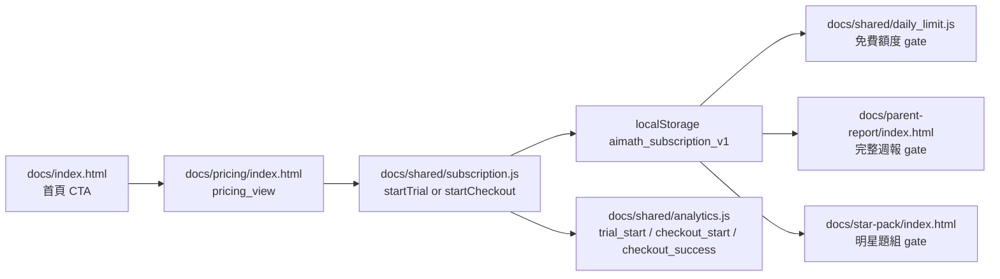
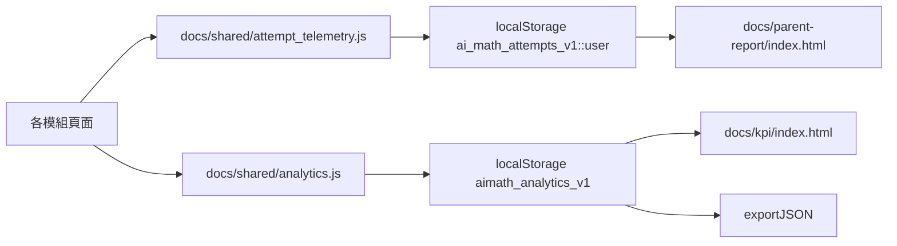
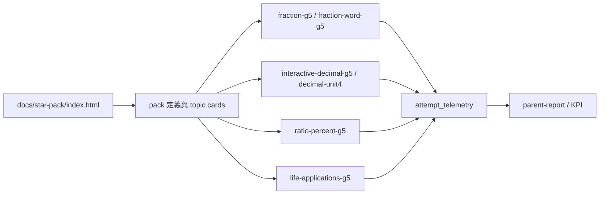
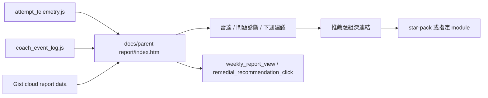

# Monetization Validation MVP — 專案盤點

> 更新日期：2026-03-09 | 目標：90 天內驗證「台灣國小五六年級數學補弱」能否穩定收費

---

## 1. 現有頁面清單

### 練習模組（17 個，所有有學生登入 + 作答追蹤）

| 模組 | 路徑 | 年級 | 題數 | 主題 |
|------|------|------|------|------|
| 考前衝刺 | exam-sprint/ | G5-6 | 混合 | 進階題 |
| 帝國闖關 | interactive-g5-empire/ | G5 | 320 | 遊戲化綜合 |
| 生活包1帝國 | interactive-g5-life-pack1-empire/ | G5 | 200 | 生活應用 |
| 生活包1+帝國 | interactive-g5-life-pack1plus-empire/ | G5 | 240 | 生活應用+ |
| 生活包2帝國 | interactive-g5-life-pack2-empire/ | G5 | 200 | 生活應用 |
| 生活包2+帝國 | interactive-g5-life-pack2plus-empire/ | G5 | 250 | 生活應用+ |
| 分數應用題 | fraction-word-g5/ | G5 | 160 | ★分數 |
| 分數基礎 | fraction-g5/ | G5 | 123 | ★分數 |
| 小數互動 | interactive-decimal-g5/ | G5 | 240 | ★小數 |
| 小數單元4 | decimal-unit4/ | G5 | 94 | ★小數 |
| 百分率比率 | ratio-percent-g5/ | G5 | 179 | ★百分率 |
| 生活應用 | life-applications-g5/ | G5 | 300 | ★生活應用 |
| 體積 | volume-g5/ | G5 | 147 | 體積 |
| 大滿貫 | g5-grand-slam/ | G5 | 188 | 綜合 |
| 核心基礎 | interactive-g56-core-foundation/ | G5-6 | 24 | 基礎 |
| 商業分數衝刺 | commercial-pack1-fraction-sprint/ | G5 | 200 | 分數（付費） |
| 離線數學 | offline-math/ | G5 | 30 | 混合 |

**總計：2,895 題（驗證通過）**

### 明星場景對應（★ 標記）

| 主題 | 模組 | 題數小計 |
|------|------|---------|
| 分數 | fraction-g5, fraction-word-g5, commercial-pack1 | 483 |
| 小數 | interactive-decimal-g5, decimal-unit4 | 334 |
| 百分率 | ratio-percent-g5 | 179 |
| 生活應用 | life-applications-g5 | 300 |
| **合計** | | **1,296** |

### 報告 / 管理頁面

| 頁面 | 路徑 | 用途 |
|------|------|------|
| 家長遠端報告 | parent-report/ | 雲端週報（name+PIN） |
| 本機週報 | report/ | CSV 匯出 |
| 教練日誌 | coach/ | 教練介面 |
| 學習地圖 | learning-map/ | 課綱地圖 |
| 任務中心 | task-center/ | 任務列表 |

### 行銷 / 資訊頁

| 頁面 | 路徑 |
|------|------|
| 首頁 | index.html |
| 定價 | pricing/ |
| KPI 儀表板 | kpi/ |
| 明星題組 | star-pack/ |
| 關於 | about/ |
| 隱私 | privacy/ |
| 條款 | terms/ |
| QA | qa/ |

---

## 2. 資料結構現況

### 學生登入（student_auth.js）
- 方式：暱稱 + 家長密碼（4-6 位數字）
- 儲存：`localStorage` key `aimath_student_auth_v1`
- 欄位：`{ version, name, pin, created_at }`
- 訂閱狀態另外存於 `aimath_subscription_v1`

### 訂閱狀態（subscription.js）
- 儲存：`localStorage` key `aimath_subscription_v1`
- 欄位：`plan_type`, `plan_status`, `trial_start`, `paid_start`, `expire_at`, `mock_mode`
- 狀態流：`free -> trial -> checkout_pending -> paid_active -> expired`

### 雲端同步（GitHub Gist）
- Gist registry: `{ entries: { NAME: { pin, data, cloud_ts } } }`
- 同步頻率：20 秒 + 每次答題
- 已修復：lookupStudentReport 使用 auth token 避免 CDN cache

### 作答追蹤（attempt_telemetry.js）
- 儲存：`ai_math_attempts_v1::<user_id>`
- 欄位：ts, question_id, ok, time_ms, max_hint, unit_id, topic_id, kind, error_type
- 上限：5000 筆 / 學生
- 已橋接 analytics：`question_submit`, `question_correct`, `hint_open`

### 事件追蹤（analytics.js）
- 儲存：`localStorage` key `aimath_analytics_v1`
- 欄位：`event`, `ts`, `user_id`, `role`, `session_id`, `page`, `data`
- 提供：`track`, `query`, `computeKPIs`, `exportJSON`

### 每日限制（daily_limit.js）
- 儲存：`aimath_daily_limit_v1`
- 免費 10 題/天
- 付費用戶繞過限制

---

## 3. 收費現況

### 定價頁（pricing/）
- 免費版 NT$0：考前衝刺 + 基礎偵測 + 三層提示 + 本地週報
- 標準版 NT$299/月：完整題庫、明星場景、遠端家長報告
- 家庭版 NT$499/月：進階練習、更多功能與家庭導向方案
- 月繳 / 年繳切換 UI 已存在

### 付款方式
- **目前**：前端 mock payment flow 已上線
- **狀態流轉**：`free -> trial -> checkout_pending -> paid_active -> expired`
- **實作檔**：`docs/shared/subscription.js`
- **正式金流**：尚未串 Stripe / 綠界等 provider

### 升級入口
- 首頁 CTA
- 定價頁試用按鈕
- 題後升級 CTA
- 家長週報 gating
- 明星題組 gating

---

## 4. 已完成 MVP 功能狀態

| 階段 | 狀態 | 內容 |
|------|------|------|
| 收費閉環 | 已完成 | pricing、mock payment、subscription storage、feature gating、upgrade CTA |
| 事件追蹤與 KPI | 已完成 | analytics logger、KPI dashboard、漏斗與事件分佈 |
| 明星場景內容包 | 已完成 | star-pack 頁、四大主題入口、免費/付費 gating |
| 家長週報 V2 | 已完成 | 概念雷達、補救排序、週報 gating、推薦題組連結 |
| Landing Page 改版 | 已完成 | Hero、痛點、使用情境、方案預覽、CTA 追蹤 |
| A/B Testing | 已完成 | 9 個測試設定、variant assignment、conversion tracking、KPI A/B dashboard |
| Release Gate / Autonomous Reviewer | 已完成 | release gate 文件、8 小時迭代 reviewer instructions、solution logic audit script |

---

## 5. 目前關鍵實作

### 收費閉環
- `docs/shared/subscription.js` — 狀態機 (free→trial→checkout_pending→paid_active→expired)
- `docs/pricing/index.html` — 三級方案頁 (Free/Standard NT$299/Family NT$499)
- `docs/shared/daily_limit.js` — 免費 10 題/天
- `docs/shared/daily_limit_wire.js` — 通用自動掛載（18/18 模組已啟用）
- `docs/shared/upgrade_banner.js` — 5 次提交或 2 分鐘後觸發
- `docs/shared/completion_upsell.js` — 帝國模組結束時觸發

### 事件追蹤與 KPI
- `docs/shared/analytics.js` — 16 事件定義，localStorage 10K 上限
- `docs/shared/attempt_telemetry.js` — 每題作答追蹤
- `docs/shared/coach_event_log.js` — 教練事件日誌
- `docs/kpi/index.html` — 12 KPI 卡片 + 轉換漏斗 + A/B 儀表板

### 明星場景
- `docs/star-pack/index.html` — 4 主題包 (分數 483、小數 334、百分率 179、生活應用 300)

### 家長週報 V2
- `docs/parent-report/index.html` — 14 區塊含雷達圖、弱點診斷、補救建議、練習實驗室
- `docs/shared/report/aggregate.js` — 象限分析 (A/B/C/D)
- `docs/shared/report/unit_report_widget.js` — 嵌入式單元報告

### A/B 測試
- `docs/shared/abtest.js` — 5 實驗 (hero_cta, trial_btn_color, pain_order, star_pack_position, free_limit)

### 學生驗證
- `docs/shared/student_auth.js` — localStorage + GitHub Gist 雲端同步

## 6. 完成度評估（2026-03-09）

| 領域 | 完成度 | 關鍵缺口 |
|------|:------:|----------|
| 訂閱/收費 | 75% | 無正式金流；localStorage-only |
| 每日限制/權限 | 95% | 18/18 模組已掛載 |
| 事件追蹤 | 85% | cohort retention 與後端化仍待補強 |
| 明星場景 | 92% | pack 完成事件與更細單題 metadata 仍可再補 |
| 家長週報 | 92% | GIST_PAT 暴露；規則式 recommendation 仍可再強化 |
| Landing Page | 92% | 仍需以真實流量驗證文案效果 |
| A/B 測試 | 85% | 已擴充 9 個測試，但樣本量仍需累積 |
| 文件 | 98% | release gate 與 reviewer docs 已補齊 |

> 詳細缺口清單見 MVP_GAP_LIST.md

### Landing Page
- `docs/index.html`

### A/B Testing
- `docs/shared/abtest.js`
- `docs/index.html`
- `docs/pricing/index.html`
- `docs/kpi/index.html`

---

## 6. 剩餘缺口分析

| 缺口 | 嚴重度 | 說明 |
|------|--------|------|
| 金流仍為 mock | 🔴 高 | 尚未串正式 payment provider / webhook |
| 訂閱資料未回寫到雲端 profile | 🟡 中 | 目前仍以前端 localStorage 為主 |
| 7/30 日留存尚未完整計算 | 🟡 中 | dashboard 已有基礎事件，但 cohort retention 還可加強 |
| recommendation engine 仍為規則式 | 🟡 中 | 尚未做更深的個人化優化 |
| A/B 測試覆蓋面仍偏小 | 🟢 低 | 目前主要掛在首頁與 pricing |

---

## 7. 後續 90 天重點

### Week 1-2：收費閉環
- 串正式 payment provider
- 建立 webhook / server-side subscription reconcile
- 降低 localStorage 可繞過風險

### Week 3-4：事件追蹤與 KPI
- 補 cohort retention
- 補主題完成率與弱點分布趨勢

### Week 5-6：明星場景內容包
- 擴充每題 metadata 與主題完成摘要
- 讓家長端直接看到 pack 成效摘要

### Week 7-8：家長週報 V2
- 加入上週比較、行動建議排序、點擊回流追蹤

### Week 9-10：Landing Page 改版
- 依 A/B 結果調整文案與 CTA 位置

### Week 11-12：A/B Testing + 優化
- 擴充更多測試位點，保留最小可行迭代節奏

---

## 8. 以現有架構落地四大商業主軸

### 8.1 收費閉環資料流

關鍵檔案與責任：

- `docs/shared/subscription.js`：訂閱狀態機、mock checkout、plan status API
- `docs/pricing/index.html`：方案比較、升級入口、pricing view 事件
- `docs/shared/daily_limit.js`：免費版題數限制
- `docs/shared/student_auth.js`：學生身分與家長 PIN
- `server.py`, `app_identity.py`：未來正式 payment provider / subscription reconcile 的可延伸後端落點

### 8.2 留存與轉換資料流

關鍵路由：

- `docs/index.html`：`landing_page_view`
- `docs/pricing/index.html`：`pricing_view`, `upgrade_click`
- `docs/*/index.html` 練習頁：`question_start`, `question_submit`, `question_correct`, `hint_open`, `retry_start`, `session_complete`
- `docs/parent-report/index.html`：`weekly_report_view`, `remedial_recommendation_click`
- `docs/kpi/index.html`：漏斗、KPI、A/B conversion summary

### 8.3 明星場景資料流

可直接重用的明星模組：

- 分數：`docs/fraction-g5/`, `docs/fraction-word-g5/`, `docs/commercial-pack1-fraction-sprint/`
- 小數：`docs/interactive-decimal-g5/`, `docs/decimal-unit4/`
- 百分率：`docs/ratio-percent-g5/`
- 生活應用：`docs/life-applications-g5/`, `docs/interactive-g5-life-pack*-empire/`

### 8.4 家長週報與補救建議資料流

後端與規則式可延伸點：

- `learning/parent_report.py`：summary / analytics / plan / practice_set 聚合
- `learning/remediation.py`：skill mapping 與補救推薦規則
- `docs/parent-report/index.html`：前端展示、付費 gating、CTA 深連結

---

## 9. 八階段持續 8 小時優化迭代節奏

原則：每一階段都只做最小可行變更，完成後立刻驗證，再做一個乾淨 commit。不要把 generated noise、內容優化、商業文案、事件 schema 混在同一個 commit。

| 階段 | 聚焦 | 主要檔案 | 驗證 | 建議 commit 訊息 |
|------|------|----------|------|------------------|
| 1 | 基線盤點與 frozen scope | `MONETIZATION_MVP_AUDIT.md`, `MVP_GAP_LIST.md`, `ROADMAP_12_WEEKS.md` | `python tools/validate_all_elementary_banks.py`, `python scripts/verify_all.py` | `docs: refresh monetization audit baseline` |
| 2 | 收費閉環強化 | `docs/shared/subscription.js`, `docs/pricing/index.html`, `docs/shared/daily_limit.js`, `docs/index.html` | 本地 flow walkthrough + 上述驗證 | `feat: harden monetization payment loop` |
| 3 | 事件 schema 正規化 | `docs/shared/analytics.js`, `docs/shared/attempt_telemetry.js`, `ANALYTICS_SCHEMA.md`, `docs/kpi/index.html` | KPI 檢查 + 事件輸出 | `feat: normalize monetization analytics events` |
| 4 | 明星場景 pack 成交入口 | `docs/star-pack/index.html`, pack metadata 來源檔 | pack 入口、題後回報、gate 驗證 | `feat: sharpen featured star pack funnel` |
| 5 | 家長週報與補救 CTA | `docs/parent-report/index.html`, `learning/parent_report.py`, `learning/remediation.py` | 週報 UI + 深連結 + gate 驗證 | `feat: strengthen parent report conversion loop` |
| 6 | 首頁轉換導向改版 | `docs/index.html`, `docs/shared/abtest.js`, `docs/shared/analytics.js` | CTA click path + KPI check | `feat: refine landing conversion narrative` |
| 7 | A/B test 實驗收斂 | `docs/shared/abtest.js`, `docs/kpi/index.html`, `AB_TESTING_SPEC.md` | variant assignment / conversion compare | `feat: expand monetization ab coverage` |
| 8 | 迭代回顧與 release gate | `METRICS_DASHBOARD.md`, `TEST_PAYMENT_FLOW.md`, roadmap docs | `python tools/validate_all_elementary_banks.py`, `python scripts/verify_all.py`, `node tools/cross_validate_remote.cjs` | `docs: record monetization iteration outcomes` |

### 每一階段的固定操作

1. 先列出只會改動的檔案，不碰無關 bank / generated data。
2. 同步 `docs` 與 `dist_ai_math_web_pages/docs`，避免 pre-commit 被 `docs_dist_identical` 擋下。
3. 先跑本地驗證：
	 - `python tools/validate_all_elementary_banks.py`
	 - `python scripts/verify_all.py`
4. 若已 push 到 `main` 且 Pages 部署完成，再跑：
	 - `node tools/cross_validate_remote.cjs`
5. 驗證通過後再 commit，commit 只包含單一商業目標。

### 最適合 8 小時連續迭代的順序

1. 第 1 小時：只做 baseline、補 audit 與 gap，不碰 UI。
2. 第 2-3 小時：收費閉環與 CTA source 命名統一。
3. 第 4 小時：analytics schema 補齊 `topic`, `grade`, `module_id`, `plan_status`, `cta_source`。
4. 第 5 小時：明星場景 pack 的 entry、completion、upsell 路徑打通。
5. 第 6 小時：家長週報三個補救 CTA 與 report gating 收斂。
6. 第 7 小時：首頁文案與 pricing 對齊，並掛 A/B 位點。
7. 第 8 小時：驗證、整理 KPI、寫 iteration note、提交乾淨 commits。
